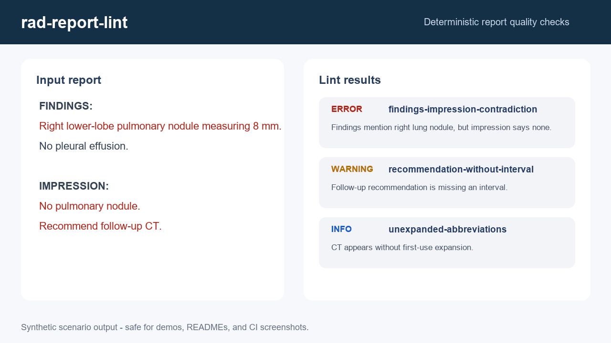

# rad-report-lint

[](https://github.com/AKaturu/rad-report-lint/actions/workflows/ci.yml)
[](https://www.python.org/)
[](LICENSE)
[](https://github.com/astral-sh/ruff)

**A deterministic linter for radiology reports — catch contradictions, inconsistencies, and quality gaps.**

`rad-report-lint` analyzes free-text radiology reports using 14 deterministic rules to identify common quality issues: contradictory laterality, normal/abnormal conflicts, modality mismatches, duplicated findings, missing comparison dates, empty impressions, recommendations without intervals, critical findings omitted from the impression, inconsistent measurements, ambiguous pronouns, excessive hedging, unexpanded abbreviations, template placeholders, and findings–impression contradictions.



## Evidence Status

| Evidence | Status |
|---|---|
| Unit and integration tests | Complete |
| Synthetic end-to-end evaluation | Complete |
| Public-data evaluation | Not completed |
| Independent expert review | Not completed |
| Institutional validation | Not completed |
| Prospective clinical validation | Not completed |

This software is a research prototype and is not intended for independent clinical decision-making.

## Quick Start

```bash
git clone https://github.com/AKaturu/rad-report-lint.git
cd rad-report-lint
python -m pip install -e .

# Lint a report file
rad-report-lint lint report.txt

# Try all demo scenarios
rad-report-lint demo

# Try a specific scenario
rad-report-lint demo contradictory-laterality

# JSON output
rad-report-lint lint report.txt --json

# CI mode (exits non-zero on errors)
rad-report-lint check report.txt

# List all rules
rad-report-lint rules
```

## Demo Media

The README demo uses a synthetic report scenario and deterministic lint output. To regenerate the GitHub assets:

```bash
python -m pip install -e ".[media]"
python scripts/generate_demo_media.py
```

See [docs/DEMO_MEDIA.md](docs/DEMO_MEDIA.md) for the asset policy.

## Example

**Input:**
```
FINDINGS: Right lower-lobe pulmonary nodule measuring 8 mm.
IMPRESSION: No pulmonary nodule.
```

**Output:**
```
ERROR
  • findings-impression-contradiction
    Findings mention abnormal 'lung' (right) but impression describes it as normal
```

## Lint Rules

| Rule | Severity | Description |
|---|---|---|
| `contradictory-laterality` | error | Same body part with conflicting laterality |
| `normal-abnormal-conflict` | error | Same body part as both normal and abnormal |
| `modality-mismatch` | warning | Multiple imaging modalities referenced |
| `duplicated-findings` | warning | Verbatim duplicate finding sentences |
| `missing-comparison-date` | warning | Comparison mentioned without date |
| `empty-impression` | error | Impression section is empty |
| `recommendation-without-interval` | warning | Follow-up recommended without time frame |
| `critical-finding-omitted` | error | Critical finding in body but not impression |
| `inconsistent-measurements` | warning | >20% variation in same structure measurements |
| `ambiguous-pronouns` | info | Pronoun without clear antecedent |
| `excessive-hedging` | warning | 5+ hedging terms used |
| `unexpanded-abbreviations` | info | Abbreviation not defined at first use |
| `template-placeholders` | error | Unfilled template placeholders remain |
| `findings-impression-contradiction` | error | Findings disagree with impression |

## Demo Scenarios

Run `rad-report-lint demo --list` to see all scenarios, or `rad-report-lint demo <scenario>` to try one:

```
normal                    — Clean report (few or no issues)
contradictory-laterality  — Right vs left conflict
normal-abnormal-conflict  — Same organ normal and abnormal
missing-comparison-date   — Comparison without date
empty-impression          — Missing impression
recommendation-without-interval  — Follow-up without timeframe
critical-omitted          — Critical finding not in impression
hedging                   — Excessive hedging language
placeholder               — Unfilled template placeholder
findings-impression-contradiction  — Findings vs impression mismatch
duplicated                — Verbatim duplicate findings
```

## Architecture

The linter uses a deterministic, regex-based approach:

1. **Parser** (`report_parser.py`) — Segments report into sections (FINDINGS, IMPRESSION, etc.), extracts body parts with laterality, detects normal/abnormal status, and extracts measurements
2. **Rules** (`rules/`) — 14 standalone rule classes, each implementing a `check(report) -> list[LintIssue]` interface
3. **Engine** (`engine.py`) — Runs all rules against a parsed report, sorts results by severity
4. **Exporter** (`exporter.py`) — Formats results as Rich tables or JSON
5. **CLI** (`cli.py`) — Typer interface with lint, check, demo, and rules commands

## License

MIT — see [LICENSE](LICENSE).
